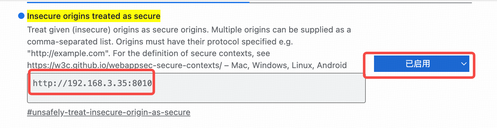

## 4. Docker Run  
[ucloud](https://passport.compshare.cn/register?referral_code=3XW3852OBmnD089hMMrtuU)注册一个账号并登录，点击头像，拷贝company id发给我，提供运行镜像。  
用镜像运行实例，防火墙开放udp端口50000～51000  
后台运行
```shell
export TENCENT_APPID=xxx
export TENCENT_SECRET_KEY=xxx
export TENCENT_SECRET_ID=xxx
export DASHSCOPE_API_KEY=xxx

conda activate nerfstream
cd livetalking
python app.py --transport webrtc --model wav2lip --avatar_id wav2lip256_avatar1 --asrtype tencent --customvideo_config data/custom_config.json
```

浏览器打开页面http://serverip:8010/dashboard-pro.html  
因为需要采集音频，需要在浏览器加白名单。在浏览器地址框输入edge://flags/#unsafely-treat-insecure-origin-as-secure，将服务端网址输入下面框中并重启浏览器
  

---
说唤醒词’你好‘触发数字人，然后提问，数字人回答问题。   
回答过程中可以通过唤醒词’你好‘打断或者点击‘打断提问’按钮。  
数字人回答完后可以继续提问。  
一段时间没有提问后需要再次唤醒才能提问。