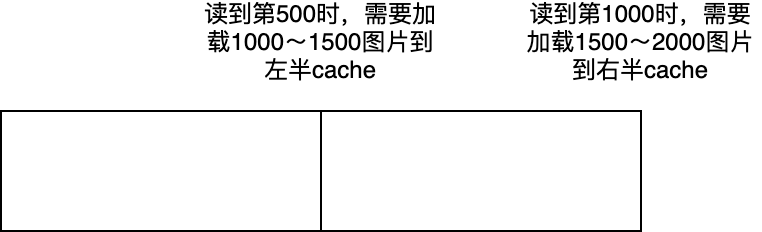

## 6. 性能优化

### 6.1 图片缓存
数字人贴回时需要用到当前全身图片，如果需要时再从硬盘读取，由于IO性能限制会极大影响程序运行速度。一般需要将全身图片预加载到内存中，如果图片数量不多，全部都加载到内存就可以了，即这种情况下原训练视频长度不要过长。  
如果训练视频长度较长，内存加载不了全部图片时，此时需要实现一种缓存策略，只加载最近需要的一段图片。下面是一个缓存示意图，假定只加载最近1000张图片

由于数字人是用的来回循环读取全身图片，实际实现时还需要考虑反向读取图片的情况。  
实现了一版imgcache代码，代码放在[知识星球](https://t.zsxq.com/7NMyO)上。