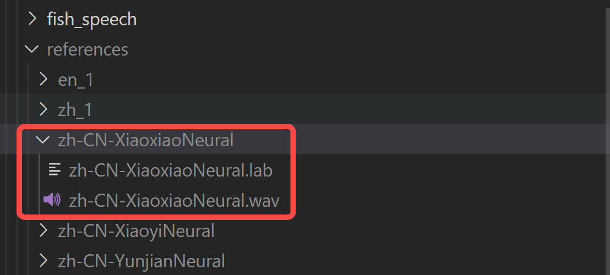

## 部署tts推理
git clone https://github.com/fishaudio/fish-speech.git
## 1. 安装环境
```
# 创建一个 python 3.10 虚拟环境, 你也可以用 virtualenv
conda create -n fish-speech python=3.10
conda activate fish-speech

# 安装 pytorch
pip install torch==2.4.1 torchvision==0.19.1 torchaudio==2.4.1

# (Ubuntu / Debian 用户) 安装 sox + ffmpeg
apt install libsox-dev ffmpeg

# (Ubuntu / Debian 用户) 安装 pyaudio
apt install build-essential \
    cmake \
    libasound-dev \
    portaudio19-dev \
    libportaudio2 \
    libportaudiocpp0
    
# 安装 fish-speech
pip3 install -e .[stable]
```

## 2. 下载模型文件
在fish-speech项目下执行
huggingface-cli download fishaudio/fish-speech-1.5 --local-dir checkpoints/fish-speech-1.5

## 3. 建立克隆声音目录
在fish-speech项目下新建/references/test文件夹，将音频文件放到该目录下，并建一个同名的lab文件，将字幕放到该文件里。
 

## 4. 启动api服务
```
python -m tools.api_server \
    --listen 0.0.0.0:8080 \
    --llama-checkpoint-path "checkpoints/fish-speech-1.5" \
    --decoder-checkpoint-path "checkpoints/fish-speech-1.5/firefly-gan-vq-fsq-8x1024-21hz-generator.pth" \
    --decoder-config-name firefly_gan_vq \
    --compile \
    --half
```

--- 
## 5. 接口说明  

### 5.1 Text-to-Speech

endpoint: `/v1/tts`  

POST:
```json
{
  "text": "string",
  "chunk_length": 200,
  "format": "wav",
  "references": [],
  "reference_id": null,
  "seed": null,
  "use_memory_cache": "off",
  "normalize": true,
  "streaming": false,
  "max_new_tokens": 1024,
  "top_p": 0.7,
  "repetition_penalty": 1.2,
  "temperature": 0.7
}
```
