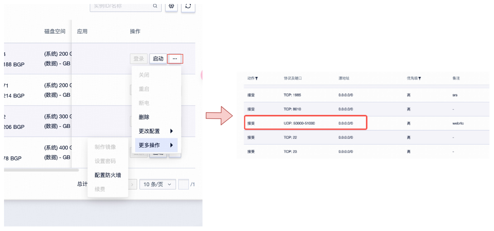

ucloud可以开放任意端口，直接用镜像部署一个实例即可运行。   
注意：**防火墙端口开放tcp 8010，udp 50000-51000**

## 1. 快速使用
在服务端运行如下命令
```
conda activate nerfstream
cd /workspace/LiveTalking
python app.py --transport webrtc --model wav2lip --avatar_id wav2lip256_avatar1
```
在浏览器里打开 http://serverip:8010/webrtcapi.html  
点击start，能看到数字人视频。然后输入文字并点击send，数字人会播报输入文字


## 2. 使用声音克隆
1,  在服务端运行  
 1.1 启动tts服务
```
conda activate sovits
cd /workspace/GPT-SoVITS
python api_v2.py
```

1.2 启动数字人服务
```
conda activate nerfstream
cd /workspace/LiveTalking
```
然后根据不同数字人模型运行（只需选择一个运行即可）  
* **ernerf**：  
```
python app.py --transport webrtc --tts gpt-sovits --TTS_SERVER http://127.0.0.1:9880 --REF_FILE ~/zero_shot_prompt.wav --REF_TEXT 希望你以后能够做的比我还好呦
```  
* **museltalk**：
```
python app.py --model musetalk --transport webrtc --tts gpt-sovits --TTS_SERVER http://127.0.0.1:9880 --REF_FILE ~/zero_shot_prompt.wav --REF_TEXT 希望你以后能够做的比我还好呦
```
* **wav2lip**：
```
python app.py --transport webrtc --model wav2lip --avatar_id wav2lip256_avatar1  --tts gpt-sovits --TTS_SERVER http://127.0.0.1:9880 --REF_FILE ~/zero_shot_prompt.wav --REF_TEXT 希望你以后能够做的比我还好呦
```

2，最后在浏览器里打开 http://serverip:8010/webrtcapi.html  
点击start，能看到数字人视频。然后输入文字并点击send，数字人会播报输入文字


## 注意事项
如果有看不到视频的问题，一定是没有开放udp端口的原因。在实例页面中参照下图配置防火墙
  
