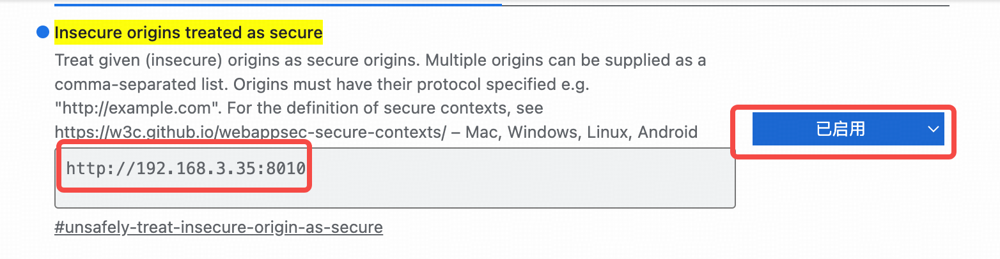

# 3. Usage  
Select the digital human model, transmission method, and TTS model respectively.  


## 3.1 Digital Human Models  
Four models are supported: ernerf, musetalk, wav2lip, and Ultralight-Digital-Human.  


### 3.1.1 Using the wav2lip Model  
- **Download Models**  
  Download the models required for wav2lip operation from the link: <https://pan.quark.cn/s/83a750323ef0>  
  1. Copy `s3fd.pth` to `wav2lip/face_detection/detection/sfd/s3fd.pth` in this project.  
  2. Copy `wav2lip256.pth` to the `models` directory of this project and rename it to `wav2lip.pth`.  
  3. Extract the `wav2lip256_avatar1.tar.gz` archive and copy the entire extracted folder to `data/avatars` of this project.  

- **Run the Model**  
  ```bash
  python app.py --transport webrtc --model wav2lip --avatar_id wav2lip256_avatar1
  ```  
  Open `http://serverip:8010/webrtcapi.html` in a browser.  
  - You can set `--batch_size` to improve GPU utilization.  
  - Use `--avatar_id` to run different digital humans.  


#### Replace with Your Custom Digital Human  
```bash
cd wav2lip
python genavatar.py --video_path xxx.mp4 --img_size 256 --avatar_id wav2lip256_avatar1 # img_size is fixed at 256 (model-dependent)
```  
After running the command, copy the files under `results/avatars` to `data/avatars` of this project.  

> **Important**: The input video must show a person with their mouth closed and not speaking.  


### 3.1.2 Using the musetalk Model  
- **Install Dependencies**  
  ```bash
  conda install ffmpeg
  pip install --no-cache-dir -U openmim 
  mim install mmengine 
  mim install "mmcv>=2.0.1" 
  mim install "mmdet>=3.1.0" 
  mim install "mmpose>=1.1.0"
  ```  

- **Download Models**  
  Download the models required for MuseTalk from the link: <https://pan.xunlei.com/s/VOW3nYho64jeCxT2sxrjcE7fA1?pwd=evnw>  
  1. Copy the files under the downloaded `models` directory to the `models` directory of this project.  
  2. Extract `musetalk_avatar1.tar.gz` and copy the entire extracted folder to `data/avatars` of this project.  

- **Run the Model**  
  ```bash
  python app.py --transport webrtc --model musetalk --avatar_id musetalk_avatar1  
  ```  
  Open `http://serverip:8010/webrtcapi.html` in a browser.  
  - You can set `--batch_size` to improve GPU utilization.  
  - Use `--avatar_id` to run different digital humans.  


#### Replace with Your Custom Digital Human  
Option 1:  
```bash
git clone https://github.com/TMElyralab/MuseTalk.git
cd MuseTalk
# Modify configs/inference/realtime.yaml: set "preparation" to True
python -m scripts.realtime_inference --inference_config configs/inference/realtime.yaml
# After running, copy the files under results/avatars to data/avatars of this project
```  

Option 2:  
```bash
python genavatar_musetalk.py --avatar_id musetalk_avatar1 --file D:\\ok\\test.mp4
# Supports video and image input; files will be automatically generated to the data/avatars directory
```  

> **Important**: The input video must show a person with their mouth closed and not speaking.  


### 3.1.3 Using the ER-Nerf Model  
The ernerf model is located in the `ernerf-rtmp` Git branch. First switch to this branch:  
```bash
git checkout ernerf-rtmp
```  

Run the model:  
```bash
python app.py --transport webrtc --model ernerf
```  


#### 3.1.3.1 Using Hubert for Audio Features  
The default audio feature extractor is wav2vec. If your trained model uses Hubert to extract audio features, start the digital human with the following command:  
```bash
python app.py --transport webrtc --model ernerf --asr_model facebook/hubert-large-ls960-ft 
```  


#### 3.1.3.2 Setting a Background Image for the Head  
```bash
python app.py --transport webrtc --model ernerf --bg_img bc.jpg 
```  


#### 3.1.3.3 Full-Body Video Stitching  
1. **Cut the video for training**  
  ```bash
  ffmpeg -i fullbody.mp4 -vf crop="400:400:100:5" train.mp4 
  ```  
  Use `train.mp4` to train the model.  

2. **Extract full-body images**  
  ```bash
  ffmpeg -i fullbody.mp4 -vf fps=25 -qmin 1 -q:v 1 -start_number 0 data/fullbody/img/%08d.png
  ```  

3. **Start the digital human**  
  ```bash
  python app.py --transport webrtc --model ernerf --fullbody --fullbody_img data/fullbody/img --fullbody_offset_x 100 --fullbody_offset_y 5 --fullbody_width 580 --fullbody_height 1080 --W 400 --H 400
  ```  
  - `--fullbody_width`, `--fullbody_height`: Width and height of the full-body video.  
  - `--W`, `--H`: Width and height of the training video.  

  > Note: If the "torso" part is not well-trained in the 3rd step of ER-Nerf training, seams may appear at the stitching joint. To fix this, add `--torso_imgs data/xxx/torso_imgs --preload 1` to the command above. This uses pre-trained torso images from the dataset instead of model inference for the torso, though slight artificial traces may appear at the neck-head junction.  


#### Replace with Your Custom Digital Human  
Replace with your self-trained model (refer to <https://github.com/Fictionarry/ER-NeRF>). When training the model, select either wav2vec or Hubert as the audio feature extractor. Organize the model files in the following structure:  
```bash
├── data
│   ├── data_kf.json  # Corresponds to transforms_train.json in the training data
│   ├── au.csv			
│   ├── pretrained
│   │   └── ngp_kf.pth  # Corresponds to the trained model file (e.g., ngp_ep00xx.pth)
```  


### 3.1.4 Using the Ultralight-Digital-Human Model  
- **Create an Avatar**  
  First train a model using the project <https://github.com/anliyuan/Ultralight-Digital-Human>, then run the following commands in this project:  
  ```bash
  cd ultralight
  python genavatar.py --dataset data_dir/  --checkpoint xxx.pth  # data_dir is the folder with processed training data
  # After running, copy the files under results/avatars to data/avatars of this project
  ```  

- **Run the Model**  
  ```bash
  python app.py --transport webrtc --model ultralight --avatar_id ultralight_avatar1
  ```  
  Open `http://serverip:8010/webrtcapi.html` in a browser.  
  - You can set `--batch_size` to improve GPU utilization.  
  - Use `--avatar_id` to run different digital humans.  

  > Note: Testing shows average performance, mainly due to unstable mouth movement when the digital human is not speaking. Feedback is welcome if you encounter issues with usage.  


## 3.2 Transmission Modes  
Three transmission modes are supported: WebRTC, RTCPush, and RTMP. The default mode is RTCPush.  


### 3.2.1 WebRTC P2P  
No SRS (Simple RTMP Server) is required for this mode:  
```bash
python app.py --transport webrtc --model wav2lip --avatar_id wav2lip256_avatar1
```  

> <font color=red>The server must open the following ports: TCP: 8010; UDP: 1-65536 </font>  

Open `http://serverip:8010/webrtcapi.html` in a browser.  


### 3.2.2 WebRTC Push to SRS  
1. **Start SRS**  
  ```bash
  export CANDIDATE='<Server Public IP>'
  docker run --rm --env CANDIDATE=$CANDIDATE \
    -p 1935:1935 -p 8080:8080 -p 1985:1985 -p 8000:8000/udp \
    registry.cn-hangzhou.aliyuncs.com/ossrs/srs:5 \
    objs/srs -c conf/rtc.conf
  ```  

2. **Run the Digital Human**  
  ```bash
  python app.py --transport rtcpush --push_url 'http://localhost:1985/rtc/v1/whip/?app=live&stream=livestream' --model wav2lip --avatar_id wav2lip256_avatar1
  ```  

> <font color=red>The server must open the following ports: TCP: 8000, 8010, 1985; UDP: 8000 </font>  

Open `http://serverip:8010/rtcpushapi.html` in a browser.  


### 3.2.3 RTMP Push  
Currently, RTMP only supports the ernerf model and will no longer be supported in future updates. For RTMP transmission, use SRS for relaying.  

1. **Install the rtmpstream Library**  
  Refer to <https://github.com/lipku/python_rtmpstream>.  

2. **Start SRS**  
  ```bash
  docker run --rm -it -p 1935:1935 -p 1985:1985 -p 8080:8080 registry.cn-hangzhou.aliyuncs.com/ossrs/srs:5
  ```  

3. **Run the Digital Human**  
  ```bash
  python app.py --transport rtmp --push_url 'rtmp://localhost/live/livestream'
  ```  

Open `http://serverip:8010/echoapi.html` in a browser.  


> **Alternative**: RTMP can also be implemented by pushing WebRTC to SRS and relaying the stream to RTMP via SRS:  
> ```bash
> export CANDIDATE='<Server Public IP>'  # Skip this step if SRS and browser access are in the same internal network
> docker run --rm --env CANDIDATE=$CANDIDATE \
>   -p 1935:1935 -p 8080:8080 -p 1985:1985 -p 8000:8000/udp \
>   registry.cn-hangzhou.aliyuncs.com/ossrs/srs:5 \
>   objs/srs -c conf/rtc2rtmp
> ```  


## 3.3 TTS Models  
Supported TTS models: EdgeTTS, GPT-Sovits, Fish-Speech, XTTS, and CosyVoice. The default model is EdgeTTS. Use `REF_FILE` to specify the voice type.  


### 3.3.1 GPT-Sovits  
For service deployment, refer to [gpt-sovits](tts/gptsovits.md).  

Run the digital human:  
```bash
python app.py --transport webrtc --model wav2lip --avatar_id wav2lip256_avatar1 --tts gpt-sovits --TTS_SERVER http://127.0.0.1:9880 --REF_FILE ref.wav --REF_TEXT xxx
```  
- `REF_TEXT`: The content of the speech in `REF_FILE` (keep the duration short).  
- Place the WAV file in the TTS server directory and use the path relative to the TTS server.  


### 3.3.2 Fish-Speech  
For service deployment, refer to [fish-speech](tts/fishspeech.md).  

Run the digital human:  
```bash
python app.py --transport webrtc --model wav2lip --avatar_id wav2lip256_avatar1 --tts fishtts --TTS_SERVER http://127.0.0.1:8080 --REF_FILE test
```  
- `--REF_FILE`: The `referenceid` from the Fish-Speech server.  


### 3.3.3 CosyVoice  
For service deployment, refer to [cosyvoice](tts/cosyvoice.md).  

Run the digital human:  
```bash
python app.py --transport webrtc --model wav2lip --avatar_id wav2lip256_avatar1 --tts cosyvoice --TTS_SERVER http://127.0.0.1:50000 --REF_FILE ref.wav --REF_TEXT xxx
```  
- `REF_TEXT`: The content of the speech in `REF_FILE` (keep the duration short).  


### 3.3.4 Tencent Cloud TTS Service  
Run the digital human:  
```bash
export TENCENT_APPID=xxx  # Your Tencent Cloud AppID
export TENCENT_SECRET_KEY=xxx  # Your Tencent Cloud Secret Key
export TENCENT_SECRET_ID=xxx  # Your Tencent Cloud Secret ID
python app.py --transport webrtc --model wav2lip --avatar_id wav2lip256_avatar1 --tts tencent  --REF_FILE 101001
```  
- `REF_FILE`: Voice ID. View the voice list at <https://cloud.tencent.com/document/product/1073/92668>, or use a custom cloned voice ID.  


### 3.3.5 Doubao TTS Service  
Run the digital human:  
```bash
export DOUBAO_APPID=xxx  # Your Doubao AppID
export DOUBAO_TOKEN=xxx  # Your Doubao Access Token
python app.py --transport webrtc --model wav2lip --avatar_id wav2lip256_avatar1 --tts doubao --REF_FILE zh_female_roumeinvyou_emo_v2_mars_bigtts
```  
- `REF_FILE`: Voice ID. View the voice list at <https://www.volcengine.com/docs/6561/1257544>, or use a custom cloned voice ID.  


### 3.3.6 XTTS  
1. **Start the XTTS Service**  
  Refer to <https://github.com/coqui-ai/xtts-streaming-server>:  
  ```bash
  docker run --gpus=all -e COQUI_TOS_AGREED=1 --rm -p 9000:80 ghcr.io/coqui-ai/xtts-streaming-server:latest
  ```  

2. **Run the Digital Human**  
  (Replace `ref.wav` with the audio file for voice cloning)  
  ```bash
  python app.py --transport webrtc --model wav2lip --avatar_id wav2lip256_avatar1 --tts xtts --REF_FILE data/ref.wav --TTS_SERVER http://localhost:9000
  ```  


## 3.4 Motion Choreography  
1. **Generate Materials**  
  ```bash
  # Extract images from the video (25 FPS)
  ffmpeg -i xxx.mp4 -vf fps=25 -qmin 1 -q:v 1 -start_number 0 data/customvideo/image/%08d.png
  # Extract audio from the video (16kHz, mono-channel PCM)
  ffmpeg -i xxx.mp4 -vn -acodec pcm_s16le -ac 1 -ar 16000 data/customvideo/audio.wav
  ```  

2. **Edit `data/custom_config.json`**  
  - Specify `imgpath` (path to extracted images) and `audiopath` (path to extracted audio).  
  - Set `audiotype` (audio type):  
    - `0`: Inference video (no additional settings needed).  
    - `1`: Mute video (uses inference video by default if not set).  
    - Values ≥2: Custom configurations.  

3. **Run the Digital Human**  
  ```bash
  python app.py --transport webrtc --model wav2lip --avatar_id wav2lip256_avatar1 --customvideo_config data/custom_config.json
  ```  

4. **Test the Choreography**  
  Open `http://<serverip>:8010/webrtcapi-custom.html` in a browser.  
  - Enter the `audiotype` configured in `custom_config.json` and click "Switch Video".  
  - For mute videos (`audiotype=1`), switching is automatic (no manual click required).  


## 3.5 Digital Human Conversation with LLM Models  

Currently, this is implemented by calling the Qianwen large model API, which is compatible with the OpenAI interface. It supports streaming output of LLM. To integrate with other large models, modify the API calling interface in `llm.py`.  

```bash
export DASHSCOPE_API_KEY=<your_api_key>
```  

Open `http://serverip:8010/rtcpushchat.html` or `http://serverip:8010/webrtcchat.html` in a browser based on the transmission mode.  


## 3.6 Multi-Session  

```bash
python app.py --transport webrtc --model wav2lip --avatar_id wav2lip256_avatar1 --max_session 3 
```  

Specify the maximum number of sessions via `max_session`. Then open multiple instances of `webrtcapi.html`.  


## 3.7 Voice Input  

1. **Using FunASR Speech Recognition**  
   Open `webrtcapi-asr.html` or `rtcpushapi-asr.html` based on the WebRTC or RTCPush transmission mode, respectively.  
   - First, click the top "start" button to connect to the video.  
   - Then, click the "connect" and "start" buttons in the voice collection box below to begin voice collection and drive the digital human to broadcast (no need to click the stop button after speaking; wait for the digital human to finish and continue speaking the next sentence).  

   If the browser cannot collect voice:  
   - Enter `edge://flags/#unsafely-treat-insecure-origin-as-secure` in the browser address bar.  
   - Enter the server URL in the box below and restart the browser.  

     

   To install your own ASR server, refer to <https://github.com/modelscope/FunASR/blob/main/runtime/python/websocket/README.md>.  


2. **Using Browser-Built-in Speech Recognition**  
   LLM is required for conversation. Run the following command in the background:  
   ```bash
   export DASHSCOPE_API_KEY=<your_api_key>
   python app.py --transport webrtc --model wav2lip --avatar_id wav2lip256_avatar1  
   ```  

   Then open the `dashboard.html` page in the browser. Since audio collection is required, you also need to add the server URL to the browser's whitelist as in the previous step.  


## 3.8 Virtual Camera Output  

Refer to <https://github.com/letmaik/pyvirtualcam> to install the virtual camera driver, then run:  

```bash
pip install pyvirtualcam
pip install pyaudio
python app.py --transport virtualcam --model wav2lip --avatar_id wav2lip256_avatar1 
```  

Open OBS or other live streaming software, select the virtual camera as the video input, and you will see the digital human video.  
Open `webrtcapi.html` (do not click "start"), directly enter text, click "send", and the digital human will speak in OBS.  


## 3.9 More Feature Integrations  

- Voice input and knowledge base Q&A: [Fay](https://github.com/xszyou/Fay)  
- Virtual anchor and subtitle capture: [Luna](https://github.com/Ikaros-521/AI-Vtuber)